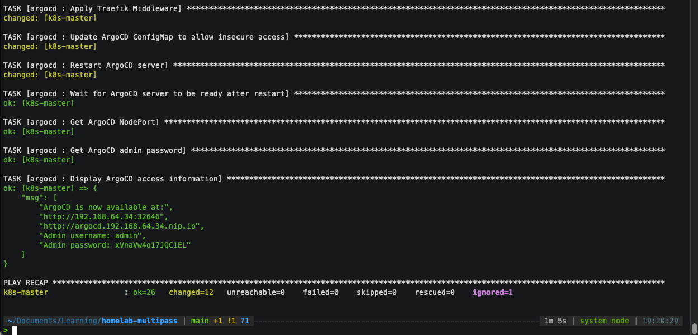

# Homelab Multipass

## Overview

K8s cluster using Multipass, Ansible, and k3s. It provides a basic framework for deploying and managing a Kubernetes cluster on a set of Ubuntu VMs.

Can be replicated on a Raspberry Pi.

## Prerequisites

- [Multipass](https://multipass.run/)
- [Ansible](https://docs.ansible.com/ansible/latest/installation_guide/index.html)

## Setup

```bash
## create group_vars/all.yml

k3s_master_ip: 
k3s_node_token: 

## Run
make setup_multipass
make setup_master
make setup_nodes

## OR

make all ## to setup everything
```

## Check K8s is installed

```bash

multipass shell k8s-master
kubectl get nodes

## or
multipass exec k8s-master -- kubectl get nodes
```

## Ansible setup



## ArgoCD setup


## Debugging stuff

```bash
multipass shell k8s-master

sudo chmod 644 /etc/rancher/k3s/k3s.yaml

## check
kubectl --kubeconfig /etc/rancher/k3s/k3s.yaml get nodes
```
